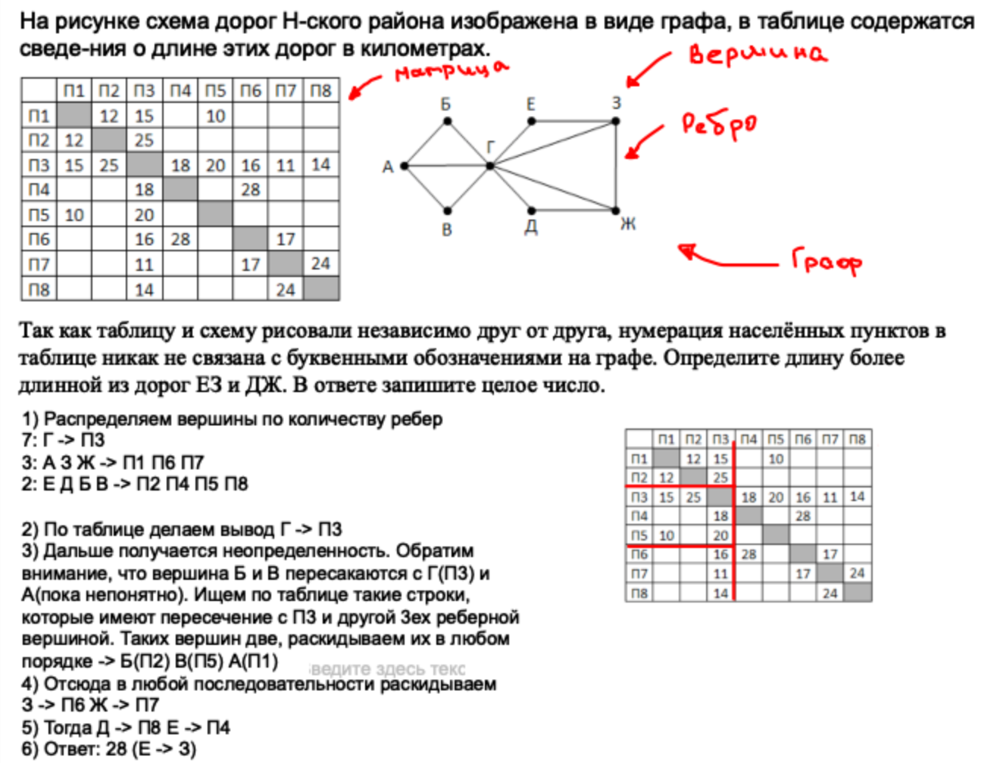

# Курс подготовки к ЕГЭ
____
## Оглавление
1. [Анализ информационных моделей](#Анализ-информационных-моделей)
2. [Таблицы истинности](#Таблицы-истинности)
3. [Поиск и сортивка баз данных](#Поиск-и-сортивка-баз-данных)
4. [Кодирование и декодирование данных](#Кодирование-и-декодирование-данных)
5. [Анализ алгоритмов](#Анализ-алгоритмов)
6. [Анализ программ](#Анализ-программ)
7. [Кодирование графической и звуковой информации](#Кодирование-графической-и-звуковой-информации)
8. [Комбинаторика](#Комбинаторика)
9. [Обработка числовой информации](#Обработка-числовой-информации)
10. [Поиск слов в документе](#Поиск-слов-в-документе)
11. [Вычисление количества информации](#Вычисление-количества-информации)
12. [Алгоритмы для исполнителей](#Алгоритмы-для-исполнителей)
13. [Количество путей](#Количество-путей)
14. [Системы счисления](#Системы-счисления)
15. [Истинность логического выражения](#Истинность-логического-выражения)
16. [Рекурсивная функция](#Рекурсивная-функция)
17. [Обработка целочисленных данных](#Обработка-целочисленных-данных)
18. [Динамическое программирование](#Динамическое-программирование)
____
## Анализ информационных моделей
[:arrow_up:Оглавление](#Оглавление)

____
## Таблицы истинности
[:arrow_up:Оглавление](#Оглавление)
____
## Поиск и сортивка баз данных
[:arrow_up:Оглавление](#Оглавление)
____
## Кодирование и декодирование данных
[:arrow_up:Оглавление](#Оглавление)
____
## Анализ алгоритмов
[:arrow_up:Оглавление](#Оглавление)
____
## Анализ программ
[:arrow_up:Оглавление](#Оглавление)
____
## Кодирование графической и звуковой информации
[:arrow_up:Оглавление](#Оглавление)
____
## Комбинаторика
[:arrow_up:Оглавление](#Оглавление)
____
## Обработка числовой информации
[:arrow_up:Оглавление](#Оглавление)
____
## Поиск слов в документе
[:arrow_up:Оглавление](#Оглавление)
____
## Вычисление количества информации
[:arrow_up:Оглавление](#Оглавление)
____
## Алгоритмы для исполнителей
[:arrow_up:Оглавление](#Оглавление)
____
## Количество путей
[:arrow_up:Оглавление](#Оглавление)
____
## Системы счисления
[:arrow_up:Оглавление](#Оглавление)
____
## Истинность логического выражения
[:arrow_up:Оглавление](#Оглавление)
____
## Рекурсивная функция
[:arrow_up:Оглавление](#Оглавление)
____
## Обработка целочисленных данных
[:arrow_up:Оглавление](#Оглавление)
____
## Динамическое-программирование
[:arrow_up:Оглавление](#Оглавление)
____